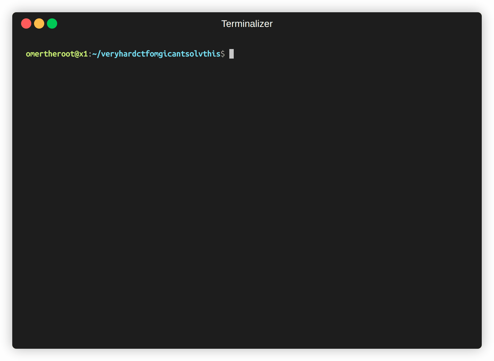

# Flagrep



**Flagrep** is a high-performance, advanced search utility designed to uncover obfuscated and encoded strings within files and directories. Built entirely with **Go's standard library**, it demonstrates efficient system programming without relying on external dependencies.

This tool is engineered to bypass common evasion techniques used in CTFs (Capture The Flag) and malware analysis by systematically applying a graph-based decoding strategy.

## Core Engineering Principles

### 1. Zero-Dependency Architecture
Flagrep is constructed using only the Go standard library (`io`, `os`, `sync`, `regexp`, `encoding/*`). This design choice ensures:
- **Portability**: Compiles to a single static binary with no "dependency hell."
- **Efficiency**: Leverages the raw performance of Go's core packages.
- **Security**: Eliminates supply chain risks associated with third-party libraries.

### 2. Breadth-First Search (BFS) Decoding Algorithm
Unlike simple recursive tools that might get stuck in deep decoding loops, Flagrep employs a **Breadth-First Search (BFS)** algorithm to explore the "state space" of possible encodings.
- **Graph Traversal**: Treats the original string as the root node and applies decoders (Base64, Hex, ROT13, etc.) to generate neighbor nodes.
- **Optimal Path Finding**: Guarantees that the simplest decoding chain (e.g., just `Base64`) is found before more complex combinations (e.g., `Base64 -> ROT13`).
- **Depth Control**: Prevents infinite execution by enforcing a strict depth limit on the search tree.

### 3. Concurrent Pipeline
Flagrep utilizes Go's concurrency primitives (`goroutines` and `channels`) to implement a worker-pool pattern. This allows for:
- **Parallel File Processing**: Multiple files are scanned and decoded simultaneously, maximizing CPU and I/O utilization.
- **Thread-Safe Output**: Synchronized output handling ensures clean, readable results even under heavy load.

## Features

- **Recursive Directory Search**: efficiently walks file trees.
- **Multi-Layer Decoding**: Automatically detects and reverses:
  - **Ciphers**: ROT13, ROT47, XOR (brute-force)
  - **Encodings**: Base64, Base32, Hexadecimal (various formats), Binary, Octal
  - **Obfuscation**: Reversed text, Spacing injection, URL encoding, HTML entities
- **Grep-Compatible CLI**: Supports standard flags like `-r` (recursive), `-i` (ignore case), and context control (`-A`, `-B`, `-C`).
- **Stdin Support**: seamlessly integrates into Unix pipes (e.g., `strings binary | flagrep pattern`).
- **ANSI Color Highlighting**: Visually distinguishes matched patterns in the terminal.
- **Shannon Entropy Filtering**: Filter files by entropy threshold to focus on encrypted/compressed content.
- **Magic Bytes Detection**: Filter files by file type signature (ELF, MZ, PDF, PNG, etc.).
- **Interactive TUI Mode**: Navigate results with keyboard controls in a terminal UI.

## Installation
 
```bash
# Install via go install

go install github.com/omertheroot/flagrep@latest

# Make sure your GOPATH is added to your PATH
# e.g on Linux:
# export PATH=$PATH:$(go env GOPATH)/bin

# OR
# Clone the repository and build

git clone https://github.com/omertheroot/flagrep.git
cd flagrep
go build -o flagrep

```

## Usage

Flagrep follows the standard `grep` usage pattern, making it intuitive for Unix users.

```bash
# Basic search
./flagrep "pattern" file.txt

# Recursive search with context
./flagrep -r -C 5 "pattern" ./directory

# Pipe integration (e.g., analyzing a binary dump)
strings malware.exe | ./flagrep "suspicious_string"

# Advanced options
# -workers: Set concurrency limit (default 10)
# -depth: Set maximum decoding depth (default 2)
./flagrep -r -workers 50 -depth 3 "flag{" .

# Entropy filtering (find high-entropy files like encrypted data)
./flagrep -r -entropy-threshold 7.0 "key" /path/to/suspicious/

# Magic bytes filtering (only scan ELF binaries)
./flagrep -r -magic "ELF,MZ" "main" /usr/bin/

# Interactive TUI mode (navigate results with j/k/Enter/q)
./flagrep -tui -r "flag" ./ctf_challenge/

# JSON output for scripting
./flagrep -r -json "password" . | jq '.file'
```

## Supported Decoders

The following decoders are included:

1. Reverse - reverses the text
2. Space Removal - removes spaces between characters
3. Base64 - standard Base64 decoder
4. Base64 URL - URL-safe Base64 decoder
5. Base32 - standard Base32 decoder
6. Hex with Spaces - "48 65 6c 6c 6f" → "Hello"
7. Hex without Spaces - "48656c6c6f" → "Hello"
8. Hex with 0x prefix - "0x48 0x65 0x6c 0x6c 0x6f" → "Hello"
9. ROT13 - rotates letters by 13 positions
10. ROT47 - rotates ASCII printable characters by 47 positions
11. Binary - "01001000" → "H"
12. Octal - "110 145 154 154 157" → "Hello"
13. URL - "%48%65%6c%6c%6f" → "Hello"
14. HTML Entities - "&lt;" → "<"
15. **XOR Brute-Force** - tries all single-byte XOR keys (0x01-0xFF)
16. **Atbash Cipher** - alphabetic substitution (A↔Z, B↔Y)
17. **Morse Code** - ".... . .-.. .-.. ---" → "HELLO"
18. **Unicode Escapes** - "\u0048\u0065\u006c\u006c\u006f" → "Hello"
19. **Base85/Ascii85** - compact binary-to-text encoding
20. **Caesar/ROT-N** - brute-forces all 26 letter rotations

The tool will try each decoder individually and in combinations to find hidden strings.

## Adding Custom Decoders

The tool is designed to be easily extensible. To add a new decoder:

1. Add a new decoder function in `decoders.go`
2. Register it in the `getDecoders()` function

Example:

```go
// Custom decoder function
func myCustomDecoder(input string) (string, error) {
    // Implement your decoding logic here
    return decodedString, nil
}

// Register in getDecoders()
func getDecoders() map[string]DecoderFunc {
    return map[string]DecoderFunc{
        // ... existing decoders ...
        "my_custom_decoder": myCustomDecoder,
    }
}
```

## Advanced Features

### Shannon Entropy Filtering

Use `-entropy-threshold` to filter files by their Shannon entropy value. High entropy (>7.0) typically indicates encrypted, compressed, or random data.

```bash
# Find patterns in high-entropy files (likely encrypted/packed)
./flagrep -r -entropy-threshold 6.5 -v "key" /suspicious/

# Combined with verbose to see entropy values
./flagrep -r -v -entropy-threshold 4.0 "password" .
```

**Entropy Ranges:**
- 0-3.5: Low entropy (repetitive data, simple text)
- 3.5-5.0: Normal text/code
- 5.0-7.0: Compressed or binary data
- 7.0-8.0: Encrypted or highly random data

### Magic Bytes Filtering

Use `-magic` to filter files by their file type signature instead of extension. Supports: `ELF`, `MZ`, `PDF`, `PNG`, `JPEG`, `GIF`, `ZIP`, `GZIP`, `RAR`, `7Z`, `SCRIPT`, `SQLITE`, and more.

```bash
# Only scan ELF binaries
./flagrep -r -magic "ELF" "main" /usr/bin/

# Scan multiple types
./flagrep -r -magic "ELF,MZ,SCRIPT" "exec" /opt/
```

### Interactive TUI Mode

Use `-tui` for an interactive terminal interface to browse results.

```bash
./flagrep -tui -r "flag{" ./ctf_challenge/
```

**Keyboard Controls:**
- `j` / `k` / `↑` / `↓`: Navigate up/down
- `n` / `p` / `PgDn` / `PgUp`: Next/previous page
- `g` / `G`: Jump to first/last result
- `/`: Search/filter results
- `Esc`: Clear filter
- `Enter` / `→`: Expand current match details
- `y`: Copy match to clipboard
- `o`: Open file in $EDITOR
- `e`: Export results to file
- `?`: Show help screen
- `q`: Quit

## Use Cases

- CTF challenges: Find hidden strings or flags that have been obfuscated
- Malware analysis: Detect encoded command strings
- Security auditing: Identify obfuscated secrets in code
- Forensic investigations: Recover encoded text from files

## License

MIT

## Contributing

Contributions are welcome! Please feel free to submit a Pull Request.
